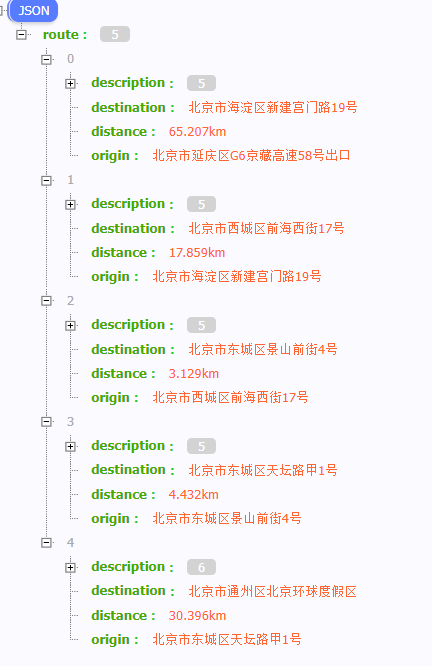
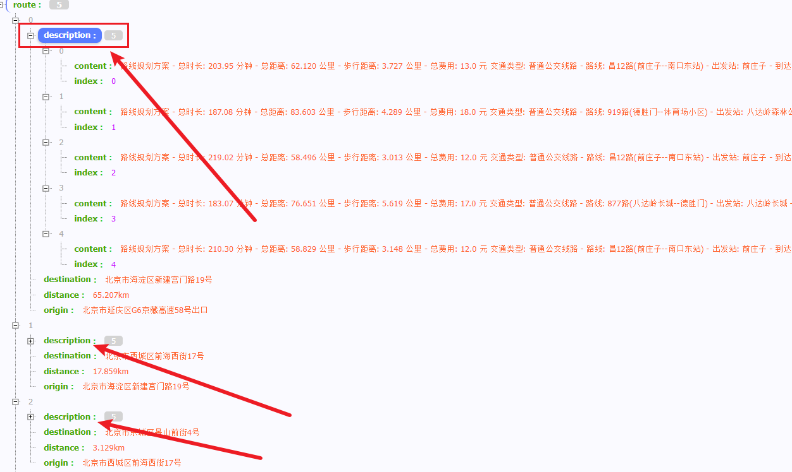

# 导航路线规划总览

这个将是导航的整个流程

请求参数：events列表，代表所有地点的位置（从/aggr 返回的 sight/food 中得到的内容中包含了 city 和 address 信息）

```json
events = [
        {
            "city": "北京",
            "address": "北京市延庆区G6京藏高速58号出口"
        },
        {
            "city": "北京",
            "address": "北京市西城区前海西街17号"
        },
        {
            "city": "北京",
            "address": "北京市通州区北京环球度假区"
        },
        {
            "city": "北京",
            "address": "北京市海淀区新建宫门路19号"
        },
        {
            "city": "北京",
            "address": "北京市东城区景山前街4号"
        },
        {
            "city": "北京",
            "address": "北京市东城区天坛路甲1号"
        }
    ]
```

### 生成 event 的经纬度信息（请求 高德api）

### 根据经纬度计算位置生成最优路线（Haversine 公式 和 最近邻算法生成路径）

### 生成导航信息（步行 + 公共交通【地铁、轮渡、公交】）

两个位置之间，会有多种导航方案，将两两之间连接生成导航信息

1. #### 将整个 events 连起来

   

2. #### 生成两点之间导航路线并生成文字描述模板

   

3. #### 具体的单个导航路线内容

   ```json
   "路线规划方案
   - 总时长: 203.95 分钟
   - 总距离: 62.120 公里
   - 步行距离: 3.727 公里
   - 总费用: 13.0 元
   
   交通类型: 普通公交线路
      - 路线: 昌12路(前庄子--南口东站) 
      - 出发站: 前庄子 
      - 到达站: 南口大堡 
      - 距离: 17.57 公里
      - 时间: 52.0 分钟
   
   步行详情:
      - 起始位置: 北京市昌平区南口镇G6京藏高速
      - 目的地: 北京市昌平区南口镇前庄子(公交站)
      - 距离: 1.828 公里
      - 时间: 26 分钟
      - 步行路线:
        - 步行1371米左转
        - 沿前沙路步行457米到达前庄子
   
   交通类型: 普通公交线路
      - 路线: 883路快车(道北)(南口北站--德胜门西) 
      - 出发站: 大堡 
      - 到达站: 西三旗桥南 
      - 距离: 29.56 公里
      - 时间: 48.5 分钟
   
   步行详情:
      - 起始位置: 北京市昌平区南口镇G6辅路北京市南口面粉厂
      - 目的地: 北京市昌平区南口镇新兴路北京市南口面粉厂
      - 距离: 0.150 公里
      - 时间: 2 分钟
      - 步行路线:
        - 沿G6辅路步行60米右转
        - 沿新兴路步行90米到达大堡
   
   交通类型: 普通公交线路
      - 路线: 688路(西三旗--廖公庄公交场站) 
      - 出发站: 西三旗桥南 
      - 到达站: 西苑 
      - 距离: 11.27 公里
      - 时间: 50.1 分钟
   
   步行详情:
      - 起始位置: 北京市海淀区青龙桥街道颐和园路亮丽园
      - 目的地: 北京市海淀区青龙桥街道颐和园颐和园-万寿山
      - 距离: 1.748 公里
      - 时间: 25 分钟
      - 步行路线:
        - 沿颐和园路步行100米向左前方行走
        - 沿颐和园路辅路步行195米向右前方行走
        - 沿颐和园路辅路步行18米左转
        - 沿同庆街步行438米向左前方行走
        - 沿同庆街步行88米向左前方行走
        - 步行126米向右前方行走
        - 步行47米左转
        - 步行186米左转
        - 步行12米左转
        - 步行10米向右后方行走
        - 步行110米左转
        - 步行123米右转
        - 步行13米左转
        - 步行282米
   
   "
   ```

### 最终结果 JSON

```json
{
    "route": [
        {
            "description": [
                {
                    "content": "路线规划方案\n- 总时长: 203.95 分钟\n- 总距离: 62.120 公里\n- 步行距离: 3.727 公里\n- 总费用: 13.0 元\n\n交通类型: 普通公交线路\n   - 路线: 昌12路(前庄子--南口东站) \n   - 出发站: 前庄子 \n   - 到达站: 南口大堡 \n   - 距离: 17.57 公里\n   - 时间: 52.0 分钟\n\n步行详情:\n   - 起始位置: 北京市昌平区南口镇G6京藏高速\n   - 目的地: 北京市昌平区南口镇前庄子(公交站)\n   - 距离: 1.828 公里\n   - 时间: 26 分钟\n   - 步行路线:\n     - 步行1371米左转\n     - 沿前沙路步行457米到达前庄子\n\n交通类型: 普通公交线路\n   - 路线: 883路快车(道北)(南口北站--德胜门西) \n   - 出发站: 大堡 \n   - 到达站: 西三旗桥南 \n   - 距离: 29.56 公里\n   - 时间: 48.5 分钟\n\n步行详情:\n   - 起始位置: 北京市昌平区南口镇G6辅路北京市南口面粉厂\n   - 目的地: 北京市昌平区南口镇新兴路北京市南口面粉厂\n   - 距离: 0.150 公里\n   - 时间: 2 分钟\n   - 步行路线:\n     - 沿G6辅路步行60米右转\n     - 沿新兴路步行90米到达大堡\n\n交通类型: 普通公交线路\n   - 路线: 688路(西三旗--廖公庄公交场站) \n   - 出发站: 西三旗桥南 \n   - 到达站: 西苑 \n   - 距离: 11.27 公里\n   - 时间: 50.1 分钟\n\n步行详情:\n   - 起始位置: 北京市海淀区青龙桥街道颐和园路亮丽园\n   - 目的地: 北京市海淀区青龙桥街道颐和园颐和园-万寿山\n   - 距离: 1.748 公里\n   - 时间: 25 分钟\n   - 步行路线:\n     - 沿颐和园路步行100米向左前方行走\n     - 沿颐和园路辅路步行195米向右前方行走\n     - 沿颐和园路辅路步行18米左转\n     - 沿同庆街步行438米向左前方行走\n     - 沿同庆街步行88米向左前方行走\n     - 步行126米向右前方行走\n     - 步行47米左转\n     - 步行186米左转\n     - 步行12米左转\n     - 步行10米向右后方行走\n     - 步行110米左转\n     - 步行123米右转\n     - 步行13米左转\n     - 步行282米\n\n",
                    "index": 0
                },
                {
                    "content": "路线规划方案\n- 总时长: 187.08 分钟\n- 总距离: 83.603 公里\n- 步行距离: 4.289 公里\n- 总费用: 18.0 元\n\n交通类型: 普通公交线路\n   - 路线: 919路(德胜门--体育场小区) \n   - 出发站: 八达岭森林公园 \n   - 到达站: 八达岭镇政府(东行) \n   - 距离: 5.79 公里\n   - 时间: 22.4 分钟\n\n步行详情:\n   - 起始位置: 北京市延庆区八达岭镇G6京藏高速八达岭国家森林公园\n   - 目的地: 北京市延庆区八达岭镇216省道八达岭国家森林公园\n   - 距离: 2.235 公里\n   - 时间: 32 分钟\n   - 步行路线:\n     - 步行1063米左转\n     - 步行38米右转\n     - 步行896米左转\n     - 沿八达岭路步行67米左转\n     - 步行71米向左前方行走\n     - 步行100米向左前方行走\n     - 沿216省道步行1米到达八达岭森林公园\n\n交通类型: 普通公交线路\n   - 路线: 919路快车(延庆电信局)(延庆电信局--德胜门) \n   - 出发站: 八达岭镇政府(临时站) \n   - 到达站: 马甸桥南 \n   - 距离: 62.69 公里\n   - 时间: 58.9 分钟\n\n交通类型: 普通公交线路\n   - 路线: 671路(四惠枢纽站--西苑) \n   - 出发站: 马甸桥东 \n   - 到达站: 西苑 \n   - 距离: 10.83 公里\n   - 时间: 44.5 分钟\n\n步行详情:\n   - 起始位置: 北京市西城区德胜街道德胜门外大街马甸南村小区\n   - 目的地: 北京市西城区德胜街道北三环中路汉庭酒店(北京马甸桥店)\n   - 距离: 0.485 公里\n   - 时间: 7 分钟\n   - 步行路线:\n     - 沿德胜门外大街步行67米向左前方行走\n     - 步行24米右转\n     - 步行183米向左前方行走\n     - 沿马甸桥步行86米向右前方行走\n     - 沿北三环中路辅路步行24米向右前方行走\n     - 步行84米右转\n     - 沿北三环中路步行17米到达马甸桥东\n\n步行详情:\n   - 起始位置: 北京市海淀区青龙桥街道颐和园路龙湖北京颐和星悦荟\n   - 目的地: 北京市海淀区青龙桥街道颐和园颐和园-万寿山\n   - 距离: 1.568 公里\n   - 时间: 22 分钟\n   - 步行路线:\n     - 沿颐和园路步行120米左转\n     - 沿同庆街步行451米向左前方行走\n     - 沿同庆街步行88米向左前方行走\n     - 步行126米向右前方行走\n     - 步行47米左转\n     - 步行186米左转\n     - 步行12米左转\n     - 步行10米向右后方行走\n     - 步行110米左转\n     - 步行123米右转\n     - 步行13米左转\n     - 步行282米\n\n",
                    "index": 1
                },
                {
                    "content": "路线规划方案\n- 总时长: 219.02 分钟\n- 总距离: 58.496 公里\n- 步行距离: 3.013 公里\n- 总费用: 12.0 元\n\n交通类型: 普通公交线路\n   - 路线: 昌12路(前庄子--南口东站) \n   - 出发站: 前庄子 \n   - 到达站: 南口东站 \n   - 距离: 19.10 公里\n   - 时间: 56.1 分钟\n\n步行详情:\n   - 起始位置: 北京市昌平区南口镇G6京藏高速\n   - 目的地: 北京市昌平区南口镇前庄子(公交站)\n   - 距离: 1.828 公里\n   - 时间: 26 分钟\n   - 步行路线:\n     - 步行1371米左转\n     - 沿前沙路步行457米到达前庄子\n\n交通类型: 普通公交线路\n   - 路线: 887路(南口北站--地铁回龙观站) \n   - 出发站: 南口东站 \n   - 到达站: 上庄东小营村 \n   - 距离: 19.24 公里\n   - 时间: 56.7 分钟\n\n交通类型: 普通公交线路\n   - 路线: 303路(西闸--西苑北站) \n   - 出发站: 上庄东小营 \n   - 到达站: 颐和园北宫门 \n   - 距离: 17.15 公里\n   - 时间: 63.1 分钟\n\n步行详情:\n   - 起始位置: 北京市海淀区上庄镇沙阳路浮青园\n   - 目的地: 北京市海淀区上庄镇上庄路清华附中上庄学校\n   - 距离: 0.130 公里\n   - 时间: 2 分钟\n   - 步行路线:\n     - 沿沙阳路步行50米左转\n     - 沿上庄路步行80米到达上庄东小营\n\n步行详情:\n   - 起始位置: 北京市海淀区青龙桥街道颐和园路\n   - 目的地: 北京市海淀区青龙桥街道颐和园颐和园-万寿山\n   - 距离: 1.054 公里\n   - 时间: 15 分钟\n   - 步行路线:\n     - 沿颐和园路步行144米右转\n     - 沿青龙桥东街步行79米左转\n     - 步行103米往前走\n     - 步行35米往前走\n     - 步行28米左转\n     - 步行41米右转\n     - 步行185米向右前方行走\n     - 步行34米右转\n     - 步行54米左转\n     - 步行27米左转\n     - 步行47米右转\n     - 步行40米右转\n     - 步行40米右转\n     - 步行72米右转\n     - 步行125米\n\n",
                    "index": 2
                },
                {
                    "content": "路线规划方案\n- 总时长: 183.07 分钟\n- 总距离: 76.651 公里\n- 步行距离: 5.619 公里\n- 总费用: 17.0 元\n\n交通类型: 普通公交线路\n   - 路线: 877路(八达岭长城--德胜门) \n   - 出发站: 八达岭长城 \n   - 到达站: 德胜门 \n   - 距离: 58.49 公里\n   - 时间: 74.2 分钟\n\n步行详情:\n   - 起始位置: 北京市延庆区八达岭镇G6京藏高速八达岭国家森林公园\n   - 目的地: 北京市延庆区八达岭镇877调度室八达岭长城金牛沟停车场\n   - 距离: 2.886 公里\n   - 时间: 41 分钟\n   - 步行路线:\n     - 步行1063米左转\n     - 步行38米右转\n     - 步行896米左转\n     - 步行608米靠左\n     - 步行246米左转\n     - 步行20米右转\n     - 步行15米到达八达岭长城\n\n交通类型: 地铁线路\n   - 路线: 地铁19号线(新宫--牡丹园) \n   - 出发站: 积水潭 \n   - 到达站: 牡丹园 \n   - 距离: 3.35 公里\n   - 时间: 7.2 分钟\n\n步行详情:\n   - 起始位置: 北京市西城区德胜街道德胜门桥中国工程院\n   - 目的地: 北京市西城区新街口街道新街口北大街物美超市(新华百货店)\n   - 距离: 0.846 公里\n   - 时间: 12 分钟\n   - 步行路线:\n     - 步行51米右转\n     - 步行103米向右前方行走\n     - 步行240米向左前方行走\n     - 步行452米到达积水潭\n\n交通类型: 地铁线路\n   - 路线: 地铁10号线外环(车道沟--车道沟) \n   - 出发站: 牡丹园 \n   - 到达站: 海淀黄庄 \n   - 距离: 4.43 公里\n   - 时间: 9.8 分钟\n\n步行详情:\n   - 起始位置: 北京市海淀区花园路街道花园东路仰源大厦\n   - 目的地: 北京市海淀区花园路街道牡丹园(地铁站)元土城遗址公园\n   - 距离: 0.210 公里\n   - 时间: 3 分钟\n   - 步行路线:\n     - 步行128米到达牡丹园\n\n交通类型: 地铁线路\n   - 路线: 地铁4号线大兴线(天宫院--安河桥北) \n   - 出发站: 海淀黄庄 \n   - 到达站: 西苑 \n   - 距离: 4.75 公里\n   - 时间: 11.6 分钟\n\n步行详情:\n   - 起始位置: 北京市海淀区青龙桥街道西苑(地铁站)龙湖北京颐和星悦荟\n   - 目的地: 北京市海淀区青龙桥街道颐和园颐和园-万寿山\n   - 距离: 1.581 公里\n   - 时间: 23 分钟\n   - 步行路线:\n     - 步行91米左转\n     - 沿天泉街步行15米右转\n     - 沿天湖街步行135米右转\n     - 步行24米左转\n     - 沿同庆街步行358米向左前方行走\n     - 沿同庆街步行88米向左前方行走\n     - 步行126米向右前方行走\n     - 步行47米左转\n     - 步行111米右转\n     - 步行33米左转\n     - 步行39米右转\n     - 步行24米向左前方行走\n     - 步行27米右转\n     - 步行30米向左前方行走\n     - 步行29米左转\n     - 步行109米右转\n     - 步行13米左转\n     - 步行282米\n\n",
                    "index": 3
                },
                {
                    "content": "路线规划方案\n- 总时长: 210.30 分钟\n- 总距离: 58.829 公里\n- 步行距离: 3.148 公里\n- 总费用: 12.0 元\n\n交通类型: 普通公交线路\n   - 路线: 昌12路(前庄子--南口东站) \n   - 出发站: 前庄子 \n   - 到达站: 南口东街 \n   - 距离: 18.44 公里\n   - 时间: 54.6 分钟\n\n步行详情:\n   - 起始位置: 北京市昌平区南口镇G6京藏高速\n   - 目的地: 北京市昌平区南口镇前庄子(公交站)\n   - 距离: 1.828 公里\n   - 时间: 26 分钟\n   - 步行路线:\n     - 步行1371米左转\n     - 沿前沙路步行457米到达前庄子\n\n交通类型: 普通公交线路\n   - 路线: 920路(延庆南菜园公交场站--地铁苹果园站) \n   - 出发站: 南口东街 \n   - 到达站: 温泉北站(临时站) \n   - 距离: 23.59 公里\n   - 时间: 56.2 分钟\n\n步行详情:\n   - 起始位置: 北京市昌平区南口镇温南路鹿牌家园\n   - 目的地: 北京市昌平区南口镇温南路鹿牌家园\n   - 距离: 0.013 公里\n   - 时间: 0 分钟\n   - 步行路线:\n     - 沿温南路步行13米到达南口东街\n\n交通类型: 普通公交线路\n   - 路线: 346路(凤凰岭--西苑北站) \n   - 出发站: 温泉 \n   - 到达站: 颐和园北宫门 \n   - 距离: 13.65 公里\n   - 时间: 54.5 分钟\n\n步行详情:\n   - 起始位置: 北京市海淀区温泉镇温阳路北京市海淀寄读学校\n   - 目的地: 北京市海淀区温泉镇温泉路北京老年医院\n   - 距离: 0.253 公里\n   - 时间: 4 分钟\n   - 步行路线:\n     - 沿温阳路步行103米向左前方行走\n     - 沿温泉路步行150米到达温泉\n\n步行详情:\n   - 起始位置: 北京市海淀区青龙桥街道颐和园路\n   - 目的地: 北京市海淀区青龙桥街道颐和园颐和园-万寿山\n   - 距离: 1.054 公里\n   - 时间: 15 分钟\n   - 步行路线:\n     - 沿颐和园路步行144米右转\n     - 沿青龙桥东街步行79米左转\n     - 步行103米往前走\n     - 步行35米往前走\n     - 步行28米左转\n     - 步行41米右转\n     - 步行185米向右前方行走\n     - 步行34米右转\n     - 步行54米左转\n     - 步行27米左转\n     - 步行47米右转\n     - 步行40米右转\n     - 步行40米右转\n     - 步行72米右转\n     - 步行125米\n\n",
                    "index": 4
                }
            ],
            "destination": "北京市海淀区新建宫门路19号",
            "distance": "65.207km",
            "origin": "北京市延庆区G6京藏高速58号出口"
        },
        {
            "description": [
                {
                    "content": "路线规划方案\n- 总时长: 69.72 分钟\n- 总距离: 16.611 公里\n- 步行距离: 3.043 公里\n- 总费用: 5.0 元\n\n交通类型: 地铁线路\n   - 路线: 地铁4号线大兴线(安河桥北--天宫院) \n   - 出发站: 西苑 \n   - 到达站: 平安里 \n   - 距离: 13.57 公里\n   - 时间: 26.2 分钟\n\n步行详情:\n   - 起始位置: 北京市海淀区青龙桥街道颐和园颐和园-万寿山\n   - 目的地: 北京市海淀区青龙桥街道西苑(地铁站)龙湖北京颐和星悦荟\n   - 距离: 1.581 公里\n   - 时间: 23 分钟\n   - 步行路线:\n     - 步行282米右转\n     - 步行13米左转\n     - 步行109米右转\n     - 步行29米向右前方行走\n     - 步行30米左转\n     - 步行27米向右前方行走\n     - 步行24米左转\n     - 步行39米右转\n     - 步行33米左转\n     - 步行111米右转\n     - 步行47米向左前方行走\n     - 步行126米向右前方行走\n     - 沿同庆街步行446米右转\n     - 步行24米左转\n     - 沿天湖街步行135米左转\n     - 沿天泉街步行15米右转\n     - 步行91米到达西苑\n\n步行详情:\n   - 起始位置: 北京市西城区新街口街道平安里(地铁站)地面停车场\n   - 目的地: 北京市西城区什刹海街道恭王府恭王府博物馆\n   - 距离: 1.462 公里\n   - 时间: 21 分钟\n   - 步行路线:\n     - 步行102米右转\n     - 沿新街口南大街步行40米右转\n     - 沿护国寺街步行582米往前走\n     - 沿定阜街步行518米右转\n     - 沿前海西街步行71米左转\n     - 步行116米右转\n     - 步行33米\n\n",
                    "index": 0
                },
                {
                    "content": "路线规划方案\n- 总时长: 102.40 分钟\n- 总距离: 18.063 公里\n- 步行距离: 2.260 公里\n- 总费用: 5.0 元\n\n交通类型: 普通公交线路\n   - 路线: 601路(地铁北宫门站--和平东桥) \n   - 出发站: 坡上村 \n   - 到达站: 马甸桥北 \n   - 距离: 11.57 公里\n   - 时间: 48.7 分钟\n\n步行详情:\n   - 起始位置: 北京市海淀区青龙桥街道颐和园颐和园-万寿山\n   - 目的地: 北京市海淀区青龙桥街道颐和园路中共中央党校\n   - 距离: 1.439 公里\n   - 时间: 21 分钟\n   - 步行路线:\n     - 步行282米右转\n     - 步行13米左转\n     - 步行123米右转\n     - 步行110米向左后方行走\n     - 步行10米右转\n     - 步行12米右转\n     - 步行186米左转\n     - 步行69米向右前方行走\n     - 步行114米左转\n     - 沿宫门前街步行344米右转\n     - 沿颐和园路步行176米到达坡上村\n\n交通类型: 普通公交线路\n   - 路线: 55路(祁家豁子--西安门) \n   - 出发站: 马甸桥北 \n   - 到达站: 刘海胡同 \n   - 距离: 4.24 公里\n   - 时间: 21.4 分钟\n\n步行详情:\n   - 起始位置: 北京市西城区什刹海街道德胜门内大街庆王府(不对外开放)\n   - 目的地: 北京市西城区什刹海街道恭王府恭王府博物馆\n   - 距离: 0.820 公里\n   - 时间: 12 分钟\n   - 步行路线:\n     - 沿德胜门内大街步行82米左转\n     - 沿定阜街步行518米右转\n     - 沿前海西街步行71米左转\n     - 步行116米右转\n     - 步行33米\n\n",
                    "index": 1
                },
                {
                    "content": "路线规划方案\n- 总时长: 99.83 分钟\n- 总距离: 18.577 公里\n- 步行距离: 1.795 公里\n- 总费用: 5.0 元\n\n交通类型: 普通公交线路\n   - 路线: 563路(香山公园东门--西直门公交场站) \n   - 出发站: 颐和园北宫门 \n   - 到达站: 动物园 \n   - 距离: 11.24 公里\n   - 时间: 45.4 分钟\n\n步行详情:\n   - 起始位置: 北京市海淀区青龙桥街道颐和园颐和园-万寿山\n   - 目的地: 北京市海淀区青龙桥街道颐和园路\n   - 距离: 1.054 公里\n   - 时间: 15 分钟\n   - 步行路线:\n     - 步行125米左转\n     - 步行72米左转\n     - 步行40米左转\n     - 步行40米左转\n     - 步行47米右转\n     - 步行27米右转\n     - 步行54米左转\n     - 步行34米向左前方行走\n     - 步行185米左转\n     - 步行41米右转\n     - 步行28米往前走\n     - 步行35米往前走\n     - 步行103米右转\n     - 沿青龙桥东街步行79米左转\n     - 沿颐和园路步行144米到达颐和园北宫门\n\n交通类型: 无轨电车\n   - 路线: 111路(白石桥东--崇文门) \n   - 出发站: 动物园 \n   - 到达站: 北海北门 \n   - 距离: 5.54 公里\n   - 时间: 28.8 分钟\n\n步行详情:\n   - 起始位置: 北京市西城区展览路街道西直门外大街辅路北京天文馆\n   - 目的地: 北京市西城区展览路街道西直门外大街辅路北京天文馆\n   - 距离: 0.035 公里\n   - 时间: 0 分钟\n   - 步行路线:\n     - 沿西直门外大街辅路步行35米到达动物园\n\n步行详情:\n   - 起始位置: 北京市西城区什刹海街道地安门西大街北海公园\n   - 目的地: 北京市西城区什刹海街道恭王府恭王府博物馆\n   - 距离: 0.706 公里\n   - 时间: 10 分钟\n   - 步行路线:\n     - 沿地安门西大街步行42米右转\n     - 沿前海西街步行264米左转\n     - 沿前海西街步行251米右转\n     - 步行116米右转\n     - 步行33米\n\n",
                    "index": 2
                },
                {
                    "content": "路线规划方案\n- 总时长: 81.85 分钟\n- 总距离: 17.699 公里\n- 步行距离: 2.444 公里\n- 总费用: 6.0 元\n\n交通类型: 地铁线路\n   - 路线: 地铁4号线大兴线(安河桥北--天宫院) \n   - 出发站: 西苑 \n   - 到达站: 新街口 \n   - 距离: 12.49 公里\n   - 时间: 24.4 分钟\n\n步行详情:\n   - 起始位置: 北京市海淀区青龙桥街道颐和园颐和园-万寿山\n   - 目的地: 北京市海淀区青龙桥街道西苑(地铁站)龙湖北京颐和星悦荟\n   - 距离: 1.581 公里\n   - 时间: 23 分钟\n   - 步行路线:\n     - 步行282米右转\n     - 步行13米左转\n     - 步行109米右转\n     - 步行29米向右前方行走\n     - 步行30米左转\n     - 步行27米向右前方行走\n     - 步行24米左转\n     - 步行39米右转\n     - 步行33米左转\n     - 步行111米右转\n     - 步行47米向左前方行走\n     - 步行126米向右前方行走\n     - 沿同庆街步行446米右转\n     - 步行24米左转\n     - 沿天湖街步行135米左转\n     - 沿天泉街步行15米右转\n     - 步行91米到达西苑\n\n交通类型: 无轨电车\n   - 路线: 111路(白石桥东--崇文门) \n   - 出发站: 新开胡同 \n   - 到达站: 北海北门 \n   - 距离: 2.77 公里\n   - 时间: 22.6 分钟\n\n步行详情:\n   - 起始位置: 北京市西城区新街口街道新街口(地铁站)北京市西城区文化馆\n   - 目的地: 北京市西城区新街口街道西直门内大街冠华大厦\n   - 距离: 0.157 公里\n   - 时间: 2 分钟\n   - 步行路线:\n     - 步行119米右转\n     - 沿西直门内大街步行38米到达新开胡同\n\n步行详情:\n   - 起始位置: 北京市西城区什刹海街道地安门西大街北海公园\n   - 目的地: 北京市西城区什刹海街道恭王府恭王府博物馆\n   - 距离: 0.706 公里\n   - 时间: 10 分钟\n   - 步行路线:\n     - 沿地安门西大街步行42米右转\n     - 沿前海西街步行264米左转\n     - 沿前海西街步行251米右转\n     - 步行116米右转\n     - 步行33米\n\n",
                    "index": 3
                },
                {
                    "content": "路线规划方案\n- 总时长: 67.17 分钟\n- 总距离: 17.489 公里\n- 步行距离: 2.532 公里\n- 总费用: 5.0 元\n\n交通类型: 地铁线路\n   - 路线: 地铁4号线大兴线(安河桥北--天宫院) \n   - 出发站: 西苑 \n   - 到达站: 平安里 \n   - 距离: 13.57 公里\n   - 时间: 26.2 分钟\n\n步行详情:\n   - 起始位置: 北京市海淀区青龙桥街道颐和园颐和园-万寿山\n   - 目的地: 北京市海淀区青龙桥街道西苑(地铁站)龙湖北京颐和星悦荟\n   - 距离: 1.581 公里\n   - 时间: 23 分钟\n   - 步行路线:\n     - 步行282米右转\n     - 步行13米左转\n     - 步行109米右转\n     - 步行29米向右前方行走\n     - 步行30米左转\n     - 步行27米向右前方行走\n     - 步行24米左转\n     - 步行39米右转\n     - 步行33米左转\n     - 步行111米右转\n     - 步行47米向左前方行走\n     - 步行126米向右前方行走\n     - 沿同庆街步行446米右转\n     - 步行24米左转\n     - 沿天湖街步行135米左转\n     - 沿天泉街步行15米右转\n     - 步行91米到达西苑\n\n交通类型: 地铁线路\n   - 路线: 地铁6号线(金安桥--潞城) \n   - 出发站: 平安里 \n   - 到达站: 北海北 \n   - 距离: 1.39 公里\n   - 时间: 4.8 分钟\n\n步行详情:\n   - 起始位置: 北京市西城区新街口街道平安里(地铁站)地面停车场\n   - 目的地: 北京市西城区新街口街道平安里西大街平安里西大街-道路停车位\n   - 距离: 0.245 公里\n   - 时间: 4 分钟\n   - 步行路线:\n     - 步行341米到达平安里\n\n步行详情:\n   - 起始位置: 北京市西城区什刹海街道北海北(地铁站)贤良祠\n   - 目的地: 北京市西城区什刹海街道恭王府恭王府博物馆\n   - 距离: 0.706 公里\n   - 时间: 10 分钟\n   - 步行路线:\n     - 步行170米右转\n     - 沿龙头井街步行27米左转\n     - 沿三座桥胡同步行223米左转\n     - 沿前海西街步行137米右转\n     - 步行116米右转\n     - 步行33米\n\n",
                    "index": 4
                }
            ],
            "destination": "北京市西城区前海西街17号",
            "distance": "17.859km",
            "origin": "北京市海淀区新建宫门路19号"
        },
        {
            "description": [
                {
                    "content": "路线规划方案\n- 总时长: 71.72 分钟\n- 总距离: 5.349 公里\n- 步行距离: 2.452 公里\n- 总费用: 4.0 元\n\n交通类型: 无轨电车\n   - 路线: 111路(白石桥东--崇文门) \n   - 出发站: 北海北门 \n   - 到达站: 地安门内 \n   - 距离: 0.65 公里\n   - 时间: 13.8 分钟\n\n步行详情:\n   - 起始位置: 北京市西城区什刹海街道恭王府恭王府博物馆\n   - 目的地: 北京市西城区什刹海街道地安门西大街北海公园\n   - 距离: 0.690 公里\n   - 时间: 10 分钟\n   - 步行路线:\n     - 步行52米向左前方行走\n     - 步行148米左转\n     - 沿前海西街步行184米右转\n     - 沿前海西街步行264米左转\n     - 沿地安门西大街步行42米到达北海北门\n\n交通类型: 普通公交线路\n   - 路线: 5路(北土城公交场站--菜户营桥) \n   - 出发站: 地安门内 \n   - 到达站: 西华门 \n   - 距离: 2.25 公里\n   - 时间: 22.9 分钟\n\n步行详情:\n   - 起始位置: 北京市西城区西长安街街道北长街故宫博物院\n   - 目的地: 北京市东城区东华门街道乾清门故宫博物院\n   - 距离: 1.761 公里\n   - 时间: 25 分钟\n   - 步行路线:\n     - 沿北长街步行121米左转\n     - 沿西华门大街步行105米右转\n     - 步行538米左转\n     - 沿东华门路步行80米左转\n     - 步行59米右转\n     - 步行118米右转\n     - 步行150米右转\n     - 步行59米左转\n     - 步行91米向左前方行走\n     - 步行329米左转\n     - 步行72米右转\n     - 步行39米\n\n",
                    "index": 0
                },
                {
                    "content": "路线规划方案\n- 总时长: 62.53 分钟\n- 总距离: 7.060 公里\n- 步行距离: 3.767 公里\n- 总费用: 3.0 元\n\n交通类型: 地铁线路\n   - 路线: 地铁8号线(朱辛庄--瀛海) \n   - 出发站: 什刹海 \n   - 到达站: 金鱼胡同 \n   - 距离: 3.29 公里\n   - 时间: 8.7 分钟\n\n步行详情:\n   - 起始位置: 北京市西城区什刹海街道恭王府恭王府博物馆\n   - 目的地: 北京市西城区什刹海街道什刹海(地铁站)南锣鼓巷\n   - 距离: 1.298 公里\n   - 时间: 19 分钟\n   - 步行路线:\n     - 步行52米向左前方行走\n     - 步行148米左转\n     - 沿前海西街步行70米左转\n     - 沿毡子胡同步行15米右转\n     - 沿南官房胡同步行127米向左前方行走\n     - 沿南官房胡同步行91米靠右\n     - 沿南官房胡同步行109米左转\n     - 沿大金丝胡同步行289米向左前方行走\n     - 沿银锭桥胡同步行25米往前走\n     - 沿小石碑胡同步行19米右转\n     - 沿前海东沿步行139米左转\n     - 沿万年胡同步行89米右转\n     - 步行125米到达什刹海\n\n步行详情:\n   - 起始位置: 北京市东城区东华门街道金鱼胡同(地铁站)王府井步行街\n   - 目的地: 北京市东城区东华门街道乾清门故宫博物院\n   - 距离: 2.469 公里\n   - 时间: 35 分钟\n   - 步行路线:\n     - 步行217米右转\n     - 沿东安门大街步行313米往前走\n     - 沿东华门大街步行423米左转\n     - 沿东华门路步行538米右转\n     - 沿东华门路步行79米右转\n     - 步行59米右转\n     - 步行118米右转\n     - 步行96米右转\n     - 步行29米左转\n     - 步行27米向左前方行走\n     - 步行130米向左前方行走\n     - 步行329米左转\n     - 步行72米右转\n     - 步行39米\n\n",
                    "index": 1
                },
                {
                    "content": "路线规划方案\n- 总时长: 68.87 分钟\n- 总距离: 5.952 公里\n- 步行距离: 3.070 公里\n- 总费用: 2.0 元\n\n交通类型: 普通公交线路\n   - 路线: 5路(北土城公交场站--菜户营桥) \n   - 出发站: 鼓楼 \n   - 到达站: 西华门 \n   - 距离: 2.88 公里\n   - 时间: 25.0 分钟\n\n步行详情:\n   - 起始位置: 北京市西城区什刹海街道恭王府恭王府博物馆\n   - 目的地: 北京市西城区什刹海街道地安门外大街新地佰\n   - 距离: 1.309 公里\n   - 时间: 19 分钟\n   - 步行路线:\n     - 步行52米向左前方行走\n     - 步行148米左转\n     - 沿前海西街步行189米往前走\n     - 沿前海北沿步行598米右转\n     - 沿小石碑胡同步行19米右转\n     - 沿前海东沿步行139米左转\n     - 沿万年胡同步行109米右转\n     - 沿地安门外大街步行55米到达鼓楼\n\n步行详情:\n   - 起始位置: 北京市西城区西长安街街道北长街故宫博物院\n   - 目的地: 北京市东城区东华门街道乾清门故宫博物院\n   - 距离: 1.761 公里\n   - 时间: 25 分钟\n   - 步行路线:\n     - 沿北长街步行121米左转\n     - 沿西华门大街步行105米右转\n     - 步行538米左转\n     - 沿东华门路步行80米左转\n     - 步行59米右转\n     - 步行118米右转\n     - 步行150米右转\n     - 步行59米左转\n     - 步行91米向左前方行走\n     - 步行329米左转\n     - 步行72米右转\n     - 步行39米\n\n",
                    "index": 2
                },
                {
                    "content": "路线规划方案\n- 总时长: 58.28 分钟\n- 总距离: 6.928 公里\n- 步行距离: 3.281 公里\n- 总费用: 3.0 元\n\n交通类型: 地铁线路\n   - 路线: 地铁6号线(金安桥--潞城) \n   - 出发站: 北海北 \n   - 到达站: 南锣鼓巷 \n   - 距离: 1.38 公里\n   - 时间: 4.7 分钟\n\n步行详情:\n   - 起始位置: 北京市西城区什刹海街道恭王府恭王府博物馆\n   - 目的地: 北京市西城区什刹海街道北海北(地铁站)贤良祠\n   - 距离: 0.690 公里\n   - 时间: 10 分钟\n   - 步行路线:\n     - 步行52米向左前方行走\n     - 步行148米左转\n     - 沿前海西街步行70米右转\n     - 沿三座桥胡同步行223米右转\n     - 沿龙头井街步行27米左转\n     - 步行170米到达北海北\n\n交通类型: 地铁线路\n   - 路线: 地铁8号线(朱辛庄--瀛海) \n   - 出发站: 南锣鼓巷 \n   - 到达站: 金鱼胡同 \n   - 距离: 2.27 公里\n   - 时间: 6.7 分钟\n\n步行详情:\n   - 起始位置: 北京市东城区景山街道必胜客(南锣鼓巷餐厅)\n   - 目的地: 北京市东城区交道口街道南锣鼓巷(地铁站)南锣鼓巷北海故宫景山地面停车场\n   - 距离: 0.122 公里\n   - 时间: 2 分钟\n   - 步行路线:\n     - 步行184米到达南锣鼓巷\n\n步行详情:\n   - 起始位置: 北京市东城区东华门街道金鱼胡同(地铁站)王府井步行街\n   - 目的地: 北京市东城区东华门街道乾清门故宫博物院\n   - 距离: 2.469 公里\n   - 时间: 35 分钟\n   - 步行路线:\n     - 步行217米右转\n     - 沿东安门大街步行313米往前走\n     - 沿东华门大街步行423米左转\n     - 沿东华门路步行538米右转\n     - 沿东华门路步行79米右转\n     - 步行59米右转\n     - 步行118米右转\n     - 步行96米右转\n     - 步行29米左转\n     - 步行27米向左前方行走\n     - 步行130米向左前方行走\n     - 步行329米左转\n     - 步行72米右转\n     - 步行39米\n\n",
                    "index": 3
                },
                {
                    "content": "路线规划方案\n- 总时长: 63.95 分钟\n- 总距离: 6.436 公里\n- 步行距离: 2.835 公里\n- 总费用: 5.0 元\n\n交通类型: 地铁线路\n   - 路线: 地铁6号线(金安桥--潞城) \n   - 出发站: 北海北 \n   - 到达站: 南锣鼓巷 \n   - 距离: 1.38 公里\n   - 时间: 4.7 分钟\n\n步行详情:\n   - 起始位置: 北京市西城区什刹海街道恭王府恭王府博物馆\n   - 目的地: 北京市西城区什刹海街道北海北(地铁站)贤良祠\n   - 距离: 0.690 公里\n   - 时间: 10 分钟\n   - 步行路线:\n     - 步行52米向左前方行走\n     - 步行148米左转\n     - 沿前海西街步行70米右转\n     - 沿三座桥胡同步行223米右转\n     - 沿龙头井街步行27米左转\n     - 步行170米到达北海北\n\n交通类型: 普通公交线路\n   - 路线: 60路(黄寺总政大院--龙潭公园) \n   - 出发站: 南锣鼓巷 \n   - 到达站: 锡拉胡同 \n   - 距离: 2.22 公里\n   - 时间: 18.7 分钟\n\n步行详情:\n   - 起始位置: 北京市东城区景山街道必胜客(南锣鼓巷餐厅)\n   - 目的地: 北京市东城区景山街道地安门东大街南锣鼓巷\n   - 距离: 0.133 公里\n   - 时间: 2 分钟\n   - 步行路线:\n     - 步行101米右转\n     - 沿地安门东大街步行32米到达南锣鼓巷\n\n步行详情:\n   - 起始位置: 北京市东城区东华门街道北河沿大街皇城根遗址公园\n   - 目的地: 北京市东城区东华门街道乾清门故宫博物院\n   - 距离: 2.012 公里\n   - 时间: 29 分钟\n   - 步行路线:\n     - 沿北河沿大街步行63米右转\n     - 沿东华门大街步行415米左转\n     - 沿东华门路步行538米右转\n     - 沿东华门路步行79米右转\n     - 步行59米右转\n     - 步行118米右转\n     - 步行150米右转\n     - 步行59米左转\n     - 步行91米向左前方行走\n     - 步行329米左转\n     - 步行72米右转\n     - 步行39米\n\n",
                    "index": 4
                }
            ],
            "destination": "北京市东城区景山前街4号",
            "distance": "3.129km",
            "origin": "北京市西城区前海西街17号"
        },
        {
            "description": [
                {
                    "content": "路线规划方案\n- 总时长: 71.55 分钟\n- 总距离: 7.795 公里\n- 步行距离: 2.154 公里\n- 总费用: 2.0 元\n\n交通类型: 普通公交线路\n   - 路线: 141路(时代庄园北站--宋家庄枢纽站) \n   - 出发站: 东安门大街 \n   - 到达站: 天桥 \n   - 距离: 5.64 公里\n   - 时间: 40.8 分钟\n\n步行详情:\n   - 起始位置: 北京市东城区东华门街道乾清门故宫博物院\n   - 目的地: 北京市东城区东华门街道东安门大街王府井步行街\n   - 距离: 1.463 公里\n   - 时间: 21 分钟\n   - 步行路线:\n     - 步行39米左转\n     - 步行143米右转\n     - 步行128米右转\n     - 步行319米左转\n     - 步行132米向左前方行走\n     - 沿东华门大街步行548米往前走\n     - 沿东安门大街步行154米到达东安门大街\n\n步行详情:\n   - 起始位置: 北京市西城区天桥街道天桥南大街北京天桥艺术大厦(天桥南大街)\n   - 目的地: 北京市东城区天坛街道天坛路3号天坛路1-3号小区\n   - 距离: 0.691 公里\n   - 时间: 10 分钟\n   - 步行路线:\n     - 沿天桥南大街步行170米右转\n     - 沿天坛路步行508米左转\n     - 步行13米\n\n",
                    "index": 0
                },
                {
                    "content": "路线规划方案\n- 总时长: 59.98 分钟\n- 总距离: 6.585 公里\n- 步行距离: 2.131 公里\n- 总费用: 2.0 元\n\n交通类型: 普通公交线路\n   - 路线: 2路(宽街路口南--双庙) \n   - 出发站: 东安门 \n   - 到达站: 天桥 \n   - 距离: 4.45 公里\n   - 时间: 29.6 分钟\n\n步行详情:\n   - 起始位置: 北京市东城区东华门街道乾清门故宫博物院\n   - 目的地: 北京市东城区东华门街道南河沿大街皇城根遗址公园\n   - 距离: 1.440 公里\n   - 时间: 21 分钟\n   - 步行路线:\n     - 步行39米左转\n     - 步行143米右转\n     - 步行128米右转\n     - 步行319米左转\n     - 步行132米向左前方行走\n     - 沿东华门大街步行548米右转\n     - 沿南河沿大街步行131米到达东安门\n\n步行详情:\n   - 起始位置: 北京市西城区天桥街道天桥南大街北京天桥艺术大厦(天桥南大街)\n   - 目的地: 北京市东城区天坛街道天坛路3号天坛路1-3号小区\n   - 距离: 0.691 公里\n   - 时间: 10 分钟\n   - 步行路线:\n     - 沿天桥南大街步行170米右转\n     - 沿天坛路步行508米左转\n     - 步行13米\n\n",
                    "index": 1
                },
                {
                    "content": "路线规划方案\n- 总时长: 46.30 分钟\n- 总距离: 6.322 公里\n- 步行距离: 2.589 公里\n- 总费用: 3.0 元\n\n交通类型: 地铁线路\n   - 路线: 地铁8号线(朱辛庄--瀛海) \n   - 出发站: 金鱼胡同 \n   - 到达站: 珠市口 \n   - 距离: 3.73 公里\n   - 时间: 9.3 分钟\n\n步行详情:\n   - 起始位置: 北京市东城区东华门街道乾清门故宫博物院\n   - 目的地: 北京市东城区东华门街道金鱼胡同(地铁站)王府井步行街\n   - 距离: 1.839 公里\n   - 时间: 26 分钟\n   - 步行路线:\n     - 步行39米左转\n     - 步行72米右转\n     - 步行213米向左前方行走\n     - 步行83米右转\n     - 步行216米左转\n     - 步行132米向左前方行走\n     - 沿东华门大街步行554米往前走\n     - 沿东安门大街步行313米左转\n     - 步行217米到达金鱼胡同\n\n步行详情:\n   - 起始位置: 北京市东城区天坛街道前门大街\n   - 目的地: 北京市东城区天坛街道天坛路天坛路1-3号小区\n   - 距离: 0.750 公里\n   - 时间: 11 分钟\n   - 步行路线:\n     - 步行151米右转\n     - 沿西草市街步行155米左转\n     - 步行56米右转\n     - 沿东红庙街步行388米\n\n",
                    "index": 2
                },
                {
                    "content": "路线规划方案\n- 总时长: 56.93 分钟\n- 总距离: 8.080 公里\n- 步行距离: 2.269 公里\n- 总费用: 5.0 元\n\n交通类型: 地铁线路\n   - 路线: 地铁8号线(朱辛庄--瀛海) \n   - 出发站: 金鱼胡同 \n   - 到达站: 天桥 \n   - 距离: 4.63 公里\n   - 时间: 11.2 分钟\n\n步行详情:\n   - 起始位置: 北京市东城区东华门街道乾清门故宫博物院\n   - 目的地: 北京市东城区东华门街道金鱼胡同(地铁站)王府井步行街\n   - 距离: 1.839 公里\n   - 时间: 26 分钟\n   - 步行路线:\n     - 步行39米左转\n     - 步行72米右转\n     - 步行213米向左前方行走\n     - 步行83米右转\n     - 步行216米左转\n     - 步行132米向左前方行走\n     - 沿东华门大街步行554米往前走\n     - 沿东安门大街步行313米左转\n     - 步行217米到达金鱼胡同\n\n交通类型: 普通公交线路\n   - 路线: 36路(天坛南门--华威路南口) \n   - 出发站: 天坛西门 \n   - 到达站: 金鱼池 \n   - 距离: 1.18 公里\n   - 时间: 13.3 分钟\n\n步行详情:\n   - 起始位置: 北京市东城区天坛街道天桥(地铁站)北京天桥艺术中心\n   - 目的地: 北京市东城区天坛街道天桥南大街国家自然博物馆\n   - 距离: 0.220 公里\n   - 时间: 3 分钟\n   - 步行路线:\n     - 步行172米左转\n     - 沿天桥南大街步行48米到达天坛西门\n\n步行详情:\n   - 起始位置: 北京市东城区天坛街道天坛路金鱼池西区\n   - 目的地: 北京市东城区天坛街道天坛路3号天坛路1-3号小区\n   - 距离: 0.210 公里\n   - 时间: 3 分钟\n   - 步行路线:\n     - 沿天坛路步行189米右转\n     - 步行8米往前走\n     - 步行13米\n\n",
                    "index": 3
                },
                {
                    "content": "路线规划方案\n- 总时长: 68.43 分钟\n- 总距离: 6.853 公里\n- 步行距离: 1.580 公里\n- 总费用: 4.0 元\n\n交通类型: 普通公交线路\n   - 路线: 60路(黄寺总政大院--龙潭公园) \n   - 出发站: 锡拉胡同 \n   - 到达站: 红桥路口北 \n   - 距离: 4.03 公里\n   - 时间: 31.4 分钟\n\n步行详情:\n   - 起始位置: 北京市东城区东华门街道乾清门故宫博物院\n   - 目的地: 北京市东城区东华门街道北河沿大街皇城根遗址公园\n   - 距离: 1.370 公里\n   - 时间: 20 分钟\n   - 步行路线:\n     - 步行39米左转\n     - 步行143米右转\n     - 步行128米右转\n     - 步行319米左转\n     - 步行132米向左前方行走\n     - 沿东华门大街步行546米左转\n     - 沿北河沿大街步行63米到达锡拉胡同\n\n交通类型: 无轨电车\n   - 路线: 106路(东直门枢纽站--北京南站) \n   - 出发站: 红桥路口北 \n   - 到达站: 金鱼池 \n   - 距离: 1.25 公里\n   - 时间: 14.5 分钟\n\n步行详情:\n   - 起始位置: 北京市东城区体育馆路街道崇文门外大街崇文门外大街辅路-道路停车位\n   - 目的地: 北京市东城区体育馆路街道崇文门外大街崇文门外大街辅路-道路停车位\n   - 距离: 0.015 公里\n   - 时间: 0 分钟\n   - 步行路线:\n     - 沿崇文门外大街步行15米到达红桥路口北\n\n步行详情:\n   - 起始位置: 北京市东城区天坛街道天坛路金鱼池西区\n   - 目的地: 北京市东城区天坛街道天坛路3号天坛路1-3号小区\n   - 距离: 0.195 公里\n   - 时间: 3 分钟\n   - 步行路线:\n     - 沿天坛路步行182米右转\n     - 步行13米\n\n",
                    "index": 4
                }
            ],
            "destination": "北京市东城区天坛路甲1号",
            "distance": "4.432km",
            "origin": "北京市东城区景山前街4号"
        },
        {
            "description": [
                {
                    "content": "路线规划方案\n- 总时长: 90.20 分钟\n- 总距离: 33.702 公里\n- 步行距离: 2.138 公里\n- 总费用: 6.0 元\n\n交通类型: 地铁线路\n   - 路线: 地铁7号线(北京西站--环球度假区) \n   - 出发站: 桥湾 \n   - 到达站: 环球度假区 \n   - 距离: 31.56 公里\n   - 时间: 59.7 分钟\n\n步行详情:\n   - 起始位置: 北京市东城区天坛街道天坛路3号天坛路1-3号小区\n   - 目的地: 北京市东城区前门街道桥湾(地铁站)五粮液大厦\n   - 距离: 0.879 公里\n   - 时间: 13 分钟\n   - 步行路线:\n     - 步行141米向左后方行走\n     - 沿金鱼池西街步行483米右转\n     - 沿珠市口东大街辅路步行111米向右前方行走\n     - 步行144米到达桥湾\n\n步行详情:\n   - 起始位置: 北京市通州区文景街道环球度假区(地铁站)北京环球度假区\n   - 目的地: 北京市通州区文景街道熙悦餐厅诺金度假酒店\n   - 距离: 1.259 公里\n   - 时间: 18 分钟\n   - 步行路线:\n     - 步行109米左转\n     - 步行7米靠右\n     - 步行121米往前走\n     - 步行44米右转\n     - 沿环球大道步行568米左转\n     - 沿日出巷步行303米左转\n     - 步行107米\n\n",
                    "index": 0
                },
                {
                    "content": "路线规划方案\n- 总时长: 80.65 分钟\n- 总距离: 33.807 公里\n- 步行距离: 0.979 公里\n- 总费用: 19.0 元\n\n交通类型: 地铁线路\n   - 路线: 地铁7号线(北京西站--环球度假区) \n   - 出发站: 桥湾 \n   - 到达站: 环球度假区 \n   - 距离: 31.56 公里\n   - 时间: 59.7 分钟\n\n步行详情:\n   - 起始位置: 北京市东城区天坛街道天坛路3号天坛路1-3号小区\n   - 目的地: 北京市东城区前门街道桥湾(地铁站)五粮液大厦\n   - 距离: 0.879 公里\n   - 时间: 13 分钟\n   - 步行路线:\n     - 步行141米向左后方行走\n     - 沿金鱼池西街步行483米右转\n     - 沿珠市口东大街辅路步行111米向右前方行走\n     - 步行144米到达桥湾\n\n步行详情:\n   - 起始位置: 北京市通州区文景街道环球度假区(地铁站)北京环球度假区\n   - 目的地: 北京市通州区文景街道环球度假区地铁站F南口北京环球度假区\n   - 距离: 0.100 公里\n   - 时间: 1 分钟\n   - 步行路线:\n     - 步行100米到达环球度假区F南口\n\n",
                    "index": 1
                },
                {
                    "content": "路线规划方案\n- 总时长: 148.43 分钟\n- 总距离: 35.393 公里\n- 步行距离: 1.248 公里\n- 总费用: 8.0 元\n\n交通类型: 普通公交线路\n   - 路线: 34路(虎坊桥路口东--孛罗营) \n   - 出发站: 金鱼池 \n   - 到达站: 松榆里 \n   - 距离: 7.08 公里\n   - 时间: 36.7 分钟\n\n步行详情:\n   - 起始位置: 北京市东城区天坛街道天坛路3号天坛路1-3号小区\n   - 目的地: 北京市东城区天坛街道天坛路金鱼池西区\n   - 距离: 0.210 公里\n   - 时间: 3 分钟\n   - 步行路线:\n     - 步行13米左转\n     - 步行8米左转\n     - 沿天坛路步行189米到达金鱼池\n\n交通类型: 普通公交线路\n   - 路线: 649路(赵公口客运站--地铁东夏园站) \n   - 出发站: 松榆里 \n   - 到达站: 金侨时代家园 \n   - 距离: 19.09 公里\n   - 时间: 50.4 分钟\n\n交通类型: 普通公交线路\n   - 路线: T116路(地铁潞城站--高楼金村) \n   - 出发站: 金侨时代家园 \n   - 到达站: 环球大道东口 \n   - 距离: 7.98 公里\n   - 时间: 43.5 分钟\n\n步行详情:\n   - 起始位置: 北京市通州区梨园镇云景南大街花涧溪启明星苑\n   - 目的地: 北京市通州区梨园镇金侨时代家园\n   - 距离: 0.137 公里\n   - 时间: 2 分钟\n   - 步行路线:\n     - 沿云景南大街步行15米左转\n     - 步行12米右转\n     - 沿云景南大街辅路步行21米右转\n     - 步行22米左转\n     - 步行10米左转\n     - 沿云景南大街辅路步行44米向左前方行走\n     - 步行10米右转\n     - 沿云景南大街步行3米到达金侨时代家园\n\n步行详情:\n   - 起始位置: 北京市通州区文景街道环球大道东口(公交站)北京环球度假区\n   - 目的地: 北京市通州区文景街道熙悦餐厅诺金度假酒店\n   - 距离: 0.900 公里\n   - 时间: 13 分钟\n   - 步行路线:\n     - 沿颐瑞东路步行75米右转\n     - 沿环球大道步行434米右转\n     - 沿日出巷步行284米左转\n     - 步行107米\n\n",
                    "index": 2
                },
                {
                    "content": "路线规划方案\n- 总时长: 91.65 分钟\n- 总距离: 34.447 公里\n- 步行距离: 2.230 公里\n- 总费用: 6.0 元\n\n交通类型: 地铁线路\n   - 路线: 地铁8号线(瀛海--朱辛庄) \n   - 出发站: 珠市口 \n   - 到达站: 王府井 \n   - 距离: 2.96 公里\n   - 时间: 7.6 分钟\n\n步行详情:\n   - 起始位置: 北京市东城区天坛街道天坛路天坛路1-3号小区\n   - 目的地: 北京市东城区天坛街道前门大街\n   - 距离: 0.750 公里\n   - 时间: 11 分钟\n   - 步行路线:\n     - 沿东红庙街步行388米左转\n     - 步行56米右转\n     - 沿西草市街步行155米左转\n     - 步行151米到达珠市口\n\n交通类型: 地铁线路\n   - 路线: 地铁1号线八通线(古城--环球度假区) \n   - 出发站: 王府井 \n   - 到达站: 环球度假区 \n   - 距离: 29.26 公里\n   - 时间: 52.2 分钟\n\n步行详情:\n   - 起始位置: 北京市东城区东华门街道王府井大街王府井步行街\n   - 目的地: 北京市东城区东华门街道王府井(地铁站)长安街\n   - 距离: 0.221 公里\n   - 时间: 3 分钟\n   - 步行路线:\n     - 步行165米到达王府井\n\n步行详情:\n   - 起始位置: 北京市通州区文景街道环球度假区(地铁站)北京环球度假区\n   - 目的地: 北京市通州区文景街道熙悦餐厅诺金度假酒店\n   - 距离: 1.259 公里\n   - 时间: 18 分钟\n   - 步行路线:\n     - 步行109米左转\n     - 步行7米靠右\n     - 步行121米往前走\n     - 步行44米右转\n     - 沿环球大道步行568米左转\n     - 沿日出巷步行303米左转\n     - 步行107米\n\n",
                    "index": 3
                },
                {
                    "content": "路线规划方案\n- 总时长: 155.60 分钟\n- 总距离: 38.942 公里\n- 步行距离: 1.711 公里\n- 总费用: 9.0 元\n\n交通类型: 普通公交线路\n   - 路线: 93路(前门--吕家营) \n   - 出发站: 天桥 \n   - 到达站: 方庄桥西 \n   - 距离: 6.49 公里\n   - 时间: 27.2 分钟\n\n步行详情:\n   - 起始位置: 北京市东城区天坛街道天坛路天坛路1-3号小区\n   - 目的地: 北京市西城区天桥街道天桥南大街北京天桥艺术大厦(天桥南大街)\n   - 距离: 0.673 公里\n   - 时间: 10 分钟\n   - 步行路线:\n     - 步行130米左转\n     - 沿精忠街步行16米右转\n     - 沿天坛路步行357米左转\n     - 沿天桥南大街步行170米到达天桥\n\n交通类型: 普通公交线路\n   - 路线: 649路(赵公口客运站--地铁东夏园站) \n   - 出发站: 方庄桥西 \n   - 到达站: 金侨时代家园 \n   - 距离: 22.77 公里\n   - 时间: 60.4 分钟\n\n交通类型: 普通公交线路\n   - 路线: T116路(地铁潞城站--高楼金村) \n   - 出发站: 金侨时代家园 \n   - 到达站: 环球大道东口 \n   - 距离: 7.98 公里\n   - 时间: 43.5 分钟\n\n步行详情:\n   - 起始位置: 北京市通州区梨园镇云景南大街花涧溪启明星苑\n   - 目的地: 北京市通州区梨园镇金侨时代家园\n   - 距离: 0.137 公里\n   - 时间: 2 分钟\n   - 步行路线:\n     - 沿云景南大街步行15米左转\n     - 步行12米右转\n     - 沿云景南大街辅路步行21米右转\n     - 步行22米左转\n     - 步行10米左转\n     - 沿云景南大街辅路步行44米向左前方行走\n     - 步行10米右转\n     - 沿云景南大街步行3米到达金侨时代家园\n\n步行详情:\n   - 起始位置: 北京市通州区文景街道环球大道东口(公交站)北京环球度假区\n   - 目的地: 北京市通州区文景街道熙悦餐厅诺金度假酒店\n   - 距离: 0.900 公里\n   - 时间: 13 分钟\n   - 步行路线:\n     - 沿颐瑞东路步行75米右转\n     - 沿环球大道步行434米右转\n     - 沿日出巷步行284米左转\n     - 步行107米\n\n",
                    "index": 4
                },
                {
                    "content": "路线规划方案\n- 总时长: 105.18 分钟\n- 总距离: 33.997 公里\n- 步行距离: 2.115 公里\n- 总费用: 8.0 元\n\n交通类型: 普通公交线路\n   - 路线: 57路区间(六里桥西--磁器口西) \n   - 出发站: 东城三里河 \n   - 到达站: 桥湾 \n   - 距离: 0.32 公里\n   - 时间: 15.3 分钟\n\n步行详情:\n   - 起始位置: 北京市东城区天坛街道天坛路3号天坛路1-3号小区\n   - 目的地: 北京市东城区天坛街道珠市口东大街以岭大厦\n   - 距离: 0.673 公里\n   - 时间: 10 分钟\n   - 步行路线:\n     - 步行141米向左后方行走\n     - 沿金鱼池西街步行483米右转\n     - 沿珠市口东大街辅路步行27米左转\n     - 步行11米右转\n     - 沿珠市口东大街步行11米到达东城三里河\n\n交通类型: 地铁线路\n   - 路线: 地铁7号线(北京西站--环球度假区) \n   - 出发站: 桥湾 \n   - 到达站: 环球度假区 \n   - 距离: 31.56 公里\n   - 时间: 59.7 分钟\n\n步行详情:\n   - 起始位置: 北京市东城区天坛街道珠市口东大街北京市东城区人民检察院\n   - 目的地: 北京市东城区前门街道桥湾(地铁站)五粮液大厦\n   - 距离: 0.183 公里\n   - 时间: 3 分钟\n   - 步行路线:\n     - 沿珠市口东大街辅路步行40米向左前方行走\n     - 步行143米到达桥湾\n\n步行详情:\n   - 起始位置: 北京市通州区文景街道环球度假区(地铁站)北京环球度假区\n   - 目的地: 北京市通州区文景街道熙悦餐厅诺金度假酒店\n   - 距离: 1.259 公里\n   - 时间: 18 分钟\n   - 步行路线:\n     - 步行109米左转\n     - 步行7米靠右\n     - 步行121米往前走\n     - 步行44米右转\n     - 沿环球大道步行568米左转\n     - 沿日出巷步行303米左转\n     - 步行107米\n\n",
                    "index": 5
                }
            ],
            "destination": "北京市通州区北京环球度假区",
            "distance": "30.396km",
            "origin": "北京市东城区天坛路甲1号"
        }
    ]
}
```

