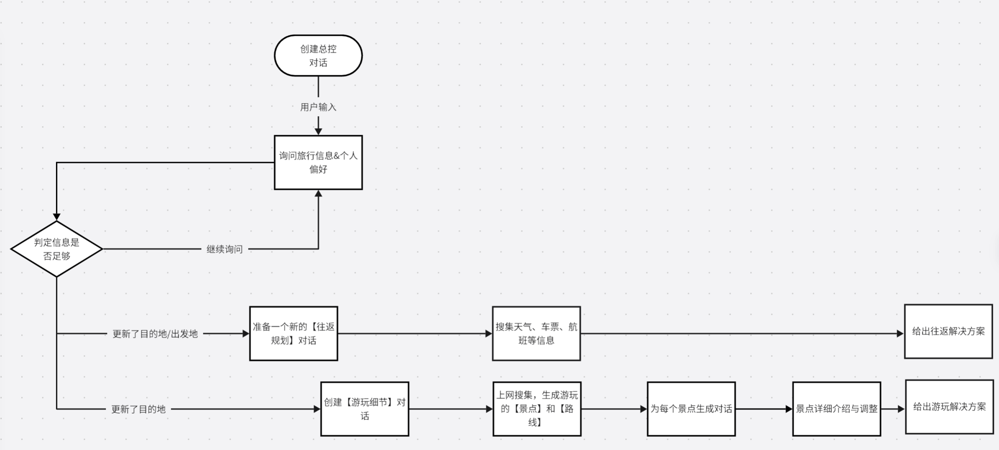
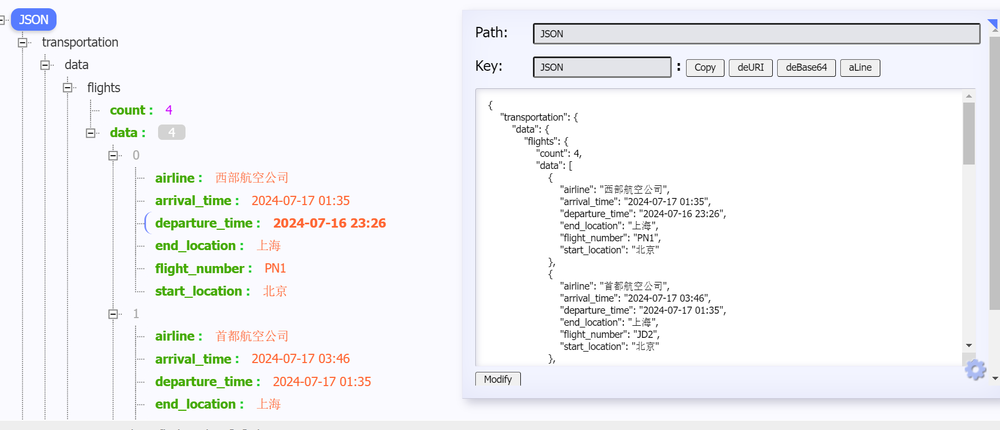
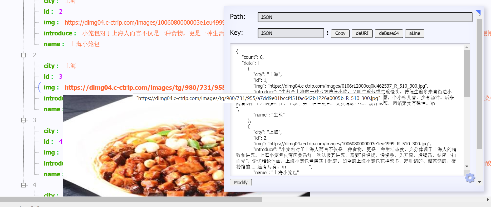
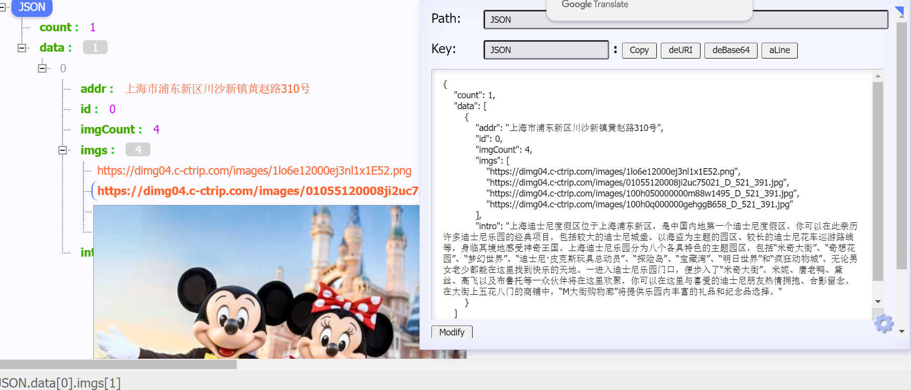
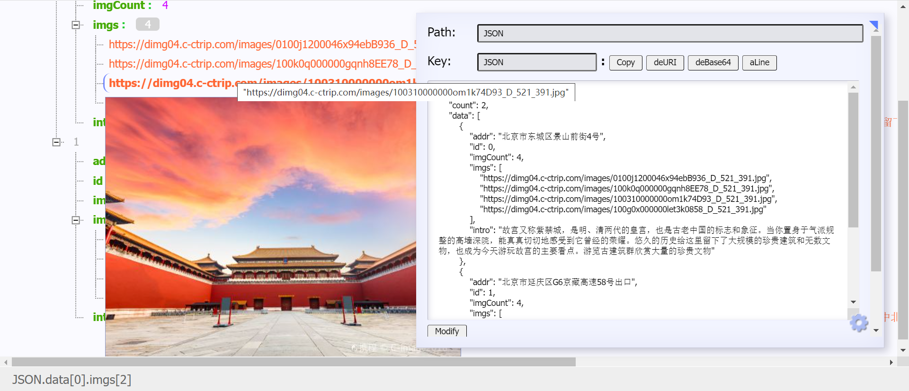

## 日志
2024/7/14

- 完成核心爬虫流程，破解反爬城市代码
- food.py 对美食的数据已爬，时间很长待优化
- views.py 的爬虫失效，因为反爬策略
- 需要协商具体数据，把整个数据链路打通可完成快速迭代
- 天气模块调用第三方api进行实现

2024/7/16

todo

- [ ] 一级字段大概分为 天气，景点，美食，出行

- 完成聚合接口
- 模拟航班车次数据
- 景点爬虫，信息收集

## 任务

总体：关于导航和出行方案：智能体会给文字回复，然后调用一个找出行方案的方法，这个方法会返回一个出行方案对象给智能体；这个对象就是json格式就好，前端可以根据里面的字段做展示，智能体可以理解然后描述成文字给用户

- event是能停留的旅游地点，景点、餐厅、住所，在地图上是一个点
- route是旅游路线，连接多个event（从上海虹桥打车去同济大学坐地铁去复旦），在地图上是一条线，同时包括线上的出行方式
- event和route是多对多的。一条路线可以穿过多个地点，一个地点可以被多条路线穿过去



1. 根据目的地 响应

   请求参数：目的地，约定返回条目数量，响应的具体信息

   1. 景点、美食信息

2. 根据出发地和目的地 响应

   根据当天的情况生成

   1. 天气、车票，航班：条目约定


<div class="swiper-slide swiperItem" style="background-image:url(https://dimg04.c-ctrip.com/images/10091f000001gsqkfCFBE_D_521_391.jpg)"></div>

## 项目文件
- 每个文件里面只要包含 main 就可以单独运行测试

- 总运行在 app.py 运行后访问，如果浏览器有 json 解析插件即可直接看到最终数据
- /aggr

    进行了多线程优化提升了速度

- /travel

  - ```json
    {
        "transportation": {
            "data": {
                "flights": {
                    "count": 4,
                    "data": [
                        {
                            "airline": "西部航空公司",
                            "arrival_time": "2024-07-17 01:35",
                            "departure_time": "2024-07-16 23:26",
                            "end_location": "上海",
                            "flight_number": "PN1",
                            "start_location": "北京"
                        },
                        {
                            "airline": "首都航空公司",
                            "arrival_time": "2024-07-17 03:46",
                            "departure_time": "2024-07-17 01:35",
                            "end_location": "上海",
                            "flight_number": "JD2",
                            "start_location": "北京"
                        },
                        {
                            "airline": "厦门航空公司",
                            "arrival_time": "2024-07-17 05:17",
                            "departure_time": "2024-07-17 03:13",
                            "end_location": "上海",
                            "flight_number": "MF3",
                            "start_location": "北京"
                        },
                        {
                            "airline": "首都航空公司",
                            "arrival_time": "2024-07-17 07:21",
                            "departure_time": "2024-07-17 05:27",
                            "end_location": "上海",
                            "flight_number": "JD4",
                            "start_location": "北京"
                        }
                    ]
                },
                "trains": {
                    "count": 3,
                    "data": [
                        {
                            "arrival_time": "2024-07-17 05:16",
                            "departure_time": "2024-07-16 23:15",
                            "end_location": "上海",
                            "start_location": "北京",
                            "train_number": "T7658",
                            "train_type": "普通列车"
                        },
                        {
                            "arrival_time": "2024-07-17 07:12",
                            "departure_time": "2024-07-17 01:26",
                            "end_location": "上海",
                            "start_location": "北京",
                            "train_number": "D6848",
                            "train_type": "动车"
                        },
                        {
                            "arrival_time": "2024-07-17 09:07",
                            "departure_time": "2024-07-17 03:20",
                            "end_location": "上海",
                            "start_location": "北京",
                            "train_number": "T4927",
                            "train_type": "普通列车"
                        }
                    ]
                }
            },
            "total": 4
        },
        "weather": {
            "adcode": "310000",
            "city": "上海市",
            "humidity": "79",
            "humidity_float": "79.0",
            "province": "上海",
            "reporttime": "2024-07-16 23:01:16",
            "temperature": "29",
            "temperature_float": "29.0",
            "weather": "多云",
            "winddirection": "西",
            "windpower": "≤3"
        }
    }
    ```

  - 

- /food

  - ```json
    {
        "count": 6,
        "data": [
            {
                "city": "上海",
                "id": 1,
                "img": "https://dimg04.c-ctrip.com/images/0106r12000cq0ki462537_R_510_300.jpg",
                "introduce": "生煎是上海的一种地方传统小吃，又叫生煎包或生煎馒头。传统生煎多来自街边小店，大铁锅煎制。面皮雪白松软，底部焦香酥脆，出锅前撒满芝麻和香葱，个小味儿香，少有汤汁。后来随着制作工艺的多样化，出现了另一种生煎包，其皮薄底不焦，汤汁浓郁，肉馅紧实有弹性。\n                ",
                "name": "生煎"
            },
            {
                "city": "上海",
                "id": 2,
                "img": "https://dimg04.c-ctrip.com/images/1006080000003e1eu4999_R_510_300.jpg",
                "introduce": "小笼包对于上海人而言不仅是一种食物，更是一种生活态度，充分体现了上海人的精致和讲究。上海小笼包皮薄肉美汤鲜，吃法极其讲究，需要“轻轻提、慢慢移、先开窗、后喝汤、结尾一扫而光”，论优雅论体面，上海小笼包当属其中翘楚。如今的上海小笼包花样繁多，鹅肝馅的、榴莲馅的、蟹粉馅的……应有尽有。\n                ",
                "name": "上海小笼包"
            },
            {
                "city": "上海",
                "id": 3,
                "img": "https://dimg04.c-ctrip.com/images/tg/980/731/955/a7dd9e01bccf451fac642b1226a0005b_R_510_300.jpg",
                "introduce": "八宝辣酱，是上海知名特色菜之一。八宝辣酱采用了鸡丁、肉丁、笋丁、虾仁、花生米等原料，经豆瓣酱炒制而成，味道香中带辣，故名“八宝辣酱”。一道菜中融合了甜、咸、辣、鲜多重口味，且口感丰富，极富上海本帮菜特色。\n\n                ",
                "name": "八宝辣酱"
            },
            {
                "city": "上海",
                "id": 4,
                "img": "https://dimg04.c-ctrip.com/images/tg/991/587/696/8efe5a3ec6d94546a040c1c16c8f3c42_R_510_300.jpg",
                "introduce": "糖醋小排是一道色香味俱全的名菜，冷热皆宜，在沪多为冷盘。这道菜以肥瘦相间的猪肋排为主料，经过多道程序烹制后色泽鲜亮，表面一层浓郁的糖醋汁酸甜可口，食之令人胃口大开，是偏好糖醋又乐于尝鲜的老饕们不容错过的美食。\n                ",
                "name": "糖醋小排"
            },
            {
                "city": "上海",
                "id": 5,
                "img": "https://dimg04.c-ctrip.com/images/100p080000003e1l502C6_R_510_300.jpg",
                "introduce": "你要是问一个上海人喜欢吃什么菜，十有八九是红烧肉。本帮红烧肉采用肥瘦相间的五花肉制成，色泽红亮，恰到好处的火候烹煮出肥而不腻的口感，香浓咸甜、浓油赤酱是其特点。浓油赤酱也是上海菜的美食偏好，代表了上海人的美食口味。\n                ",
                "name": "本帮红烧肉"
            }
        ]
    }
    ```

  - 

- /sight

  - ```json
    {
        "count": 2,
        "data": [
            {
                "addr": "北京市东城区景山前街4号",
                "id": 0,
                "imgCount": 4,
                "imgs": [
                    "https://dimg04.c-ctrip.com/images/0100j1200046x94ebB936_D_521_391.jpg",
                    "https://dimg04.c-ctrip.com/images/100k0q000000gqnh8EE78_D_521_391.jpg",
                    "https://dimg04.c-ctrip.com/images/100310000000om1k74D93_D_521_391.jpg",
                    "https://dimg04.c-ctrip.com/images/100g0x000000let3k0858_D_521_391.jpg"
                ],
                "intro": "故宫又称紫禁城，是明、清两代的皇宫，也是古老中国的标志和象征。当你置身于气派规整的高墙深院，能真真切切地感受到它曾经的荣耀。悠久的历史给这里留下了大规模的珍贵建筑和无数文物，也成为今天游玩故宫的主要看点。游览古建筑群欣赏大量的珍贵文物"
            },
            {
                "addr": "北京市延庆区G6京藏高速58号出口",
                "id": 1,
                "imgCount": 4,
                "imgs": [
                    "https://dimg04.c-ctrip.com/images/100k0z000000n1uqq02C3_D_521_391.jpg",
                    "https://dimg04.c-ctrip.com/images/0100d1200077mzcng2603_D_521_391.jpg",
                    "https://dimg04.c-ctrip.com/images/0104h1200082jay2wB9FC_D_521_391.jpg",
                    "https://dimg04.c-ctrip.com/images/1lo3v12000br3e5rj7A7B_D_521_391.jpg"
                ],
                "intro": "八达岭长城号称天下九塞之一，风光集巍峨险峻、秀丽苍翠于一体，是明长城景色中的精华。“不到长城非好汉”，很多国人都以这里为登临长城的主要选择。其中北8楼是八达岭长城海拔最高的敌楼，又名“观日台”。这里距离关城有1500多米，是俯瞰长城的佳地。"
            }
        ]
    }
    ```

  - 

  - 
### aggregation
聚合接口

智能体调用数据返回的核心 res1，res2 这两个函数
### entertainment
景点、美食相关接口

利用携程网站爬虫根据地点和类型 搜索 city 的必玩/必吃/必逛 相关信息

### flight
模拟的航班、车次数据

### weather
天气相关接口


### 注意事项
**爬虫相关数据只能用于自己开发使用，其他用途与本人无关**